# 🏛 Tayin Talep Yönetim Sistemi

🔒 Kurum içi personellerin **tayin taleplerini oluşturma, yönetme ve takip etme** süreçlerini kolaylaştırmak için geliştirilmiş modern bir sistemdir. React tabanlı ön yüz ve .NET tabanlı API ile güçlü ve kullanıcı dostu bir altyapıya sahiptir.

---

## ✨ Özellikler

- 📥 Yeni tayin talebi oluşturma  
- ❌ Talep iptal etme  
- 👁 Talepleri görüntüleme  
- 👤 Kendi profili görüntüleme  
- 🏛 Yetkililer için:  
  - Adliye, tayin tipi, personel yönetimi  
  - Talepleri onaylama / reddetme  
  - Logları inceleme  
  - Personellere yetki atama (log görüntüle, tayinleri yönet, vs.)  

---

## 🧱 Kullanılan Teknolojiler ve Mimarî

### 💻 Frontend (Kullanıcı Arayüzü)

| Teknoloji    | Açıklama                          |
|--------------|----------------------------------|
| React        | Modern web arayüzü                |
| Vite         | Hızlı build ve hot-reload         |
| Axios        | API istekleri için HTTP istemcisi|
| Lucide-React | Minimal ve modern ikonlar         |
| Tailwind     | Modern stil tasarımları           |

### ⚙ Backend (.NET API)

| Teknoloji            | Açıklama                          |
|----------------------|----------------------------------|
| ASP.NET Core Web API  | RESTful API                      |
| Entity Framework Core | Veritabanı işlemleri (Code First)|
| MSSQL                | Veritabanı                       |
| JWT                  | Kimlik doğrulama (Json Web Token)|
| BCrypt.Net           | Şifreleme ve güvenlik            |

---

## 🔧 Kurulum ve Çalıştırma

### 1. Projeyi Klonlayın

bash
git clone https://github.com/devrimdeniz/tayin-talep.git

2. Veri tabanı ve örnek verileri oluşturun ve diğer kurulum işlemleri

bash
Setup.bat

query MSSQL üzerinde veritabanını oluşturur, tabloları yaratır ve örnek verileri (admin, personeller, tayin tipleri vs.) yükler.
Sıfırlamak isterseniz queryi tekrar çalıştırabilirsiniz.

3. React Projesi ve API'yi Çalıştırmak (.NET)

bash
Start.bat

---

🔑 Varsayılan Giriş Bilgileri (Demo)

Sicil	     Şifre
AB121323     121323Sifre!
AB323121     323121Sifre!
AB221332     221332Sifre!
AB211322     211322Sifre!
AB267167     267167Sifre!
AB189289     189289Sifre!
AB176287     176287Sifre!
AB213312     213312Sifre!
AB98456      98456Sifre!

Şifreler bcrypt ile güvenli bir şekilde hashlenerek veritabanında saklanmaktadır 

---

📸 Görseller

### 🔐 Giriş Ekranı
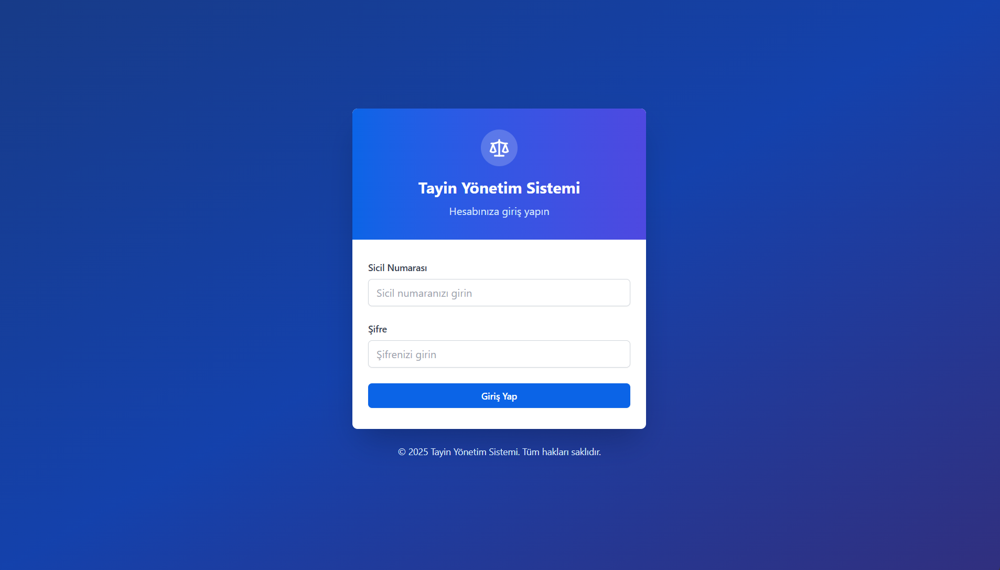

### 🖼 Ana Sayfa
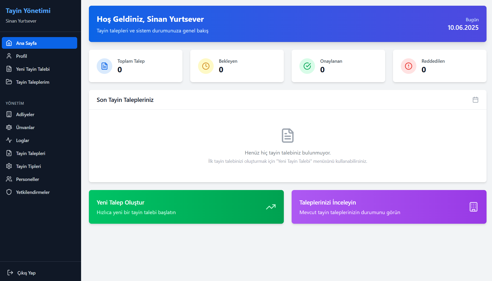

### 👤 Profil
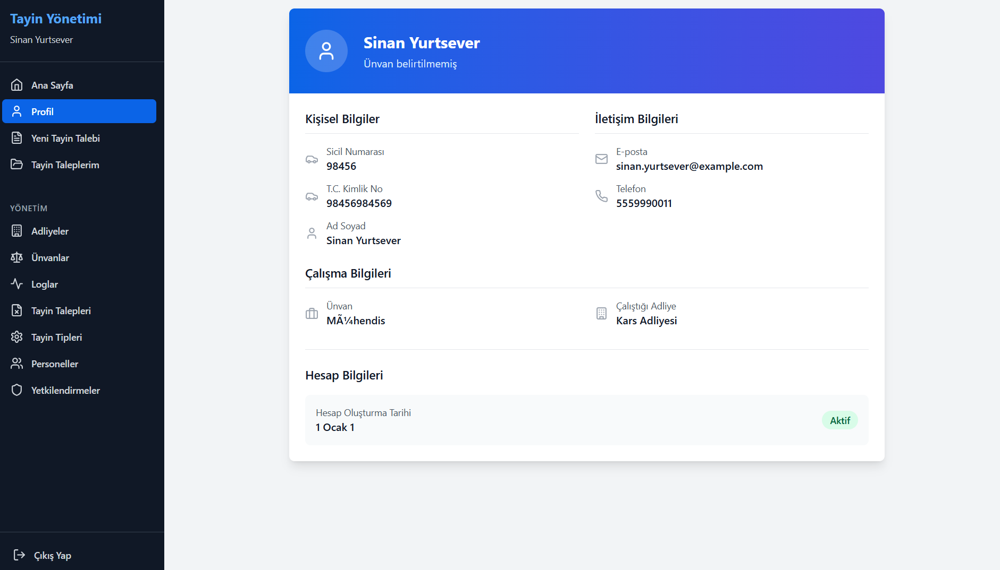

### 🧾 Tayin Talep Formu
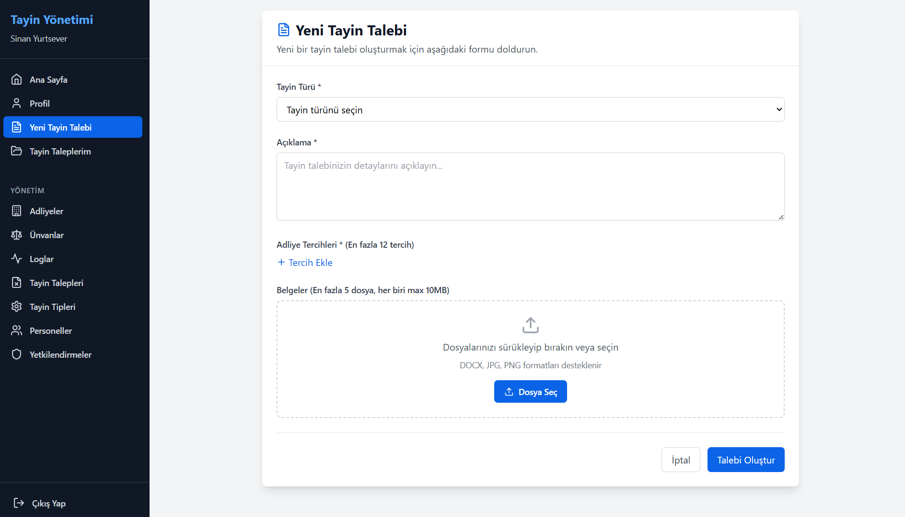
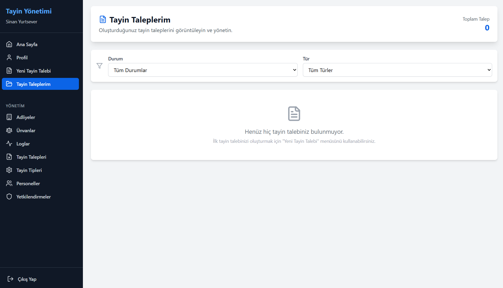

### 🔑 Yetkili
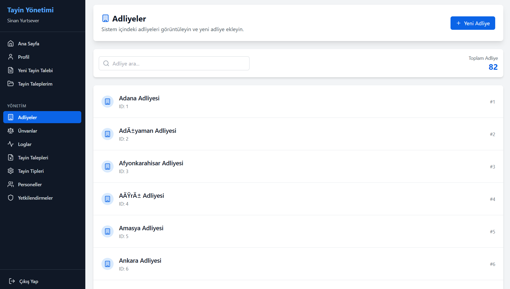
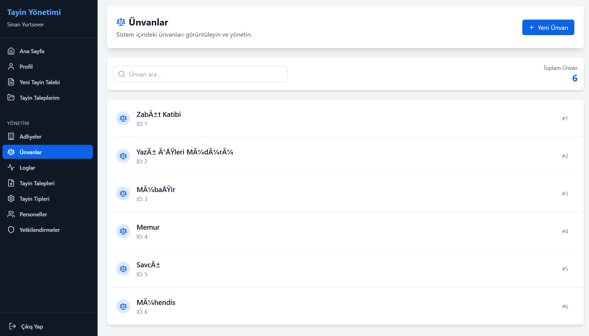
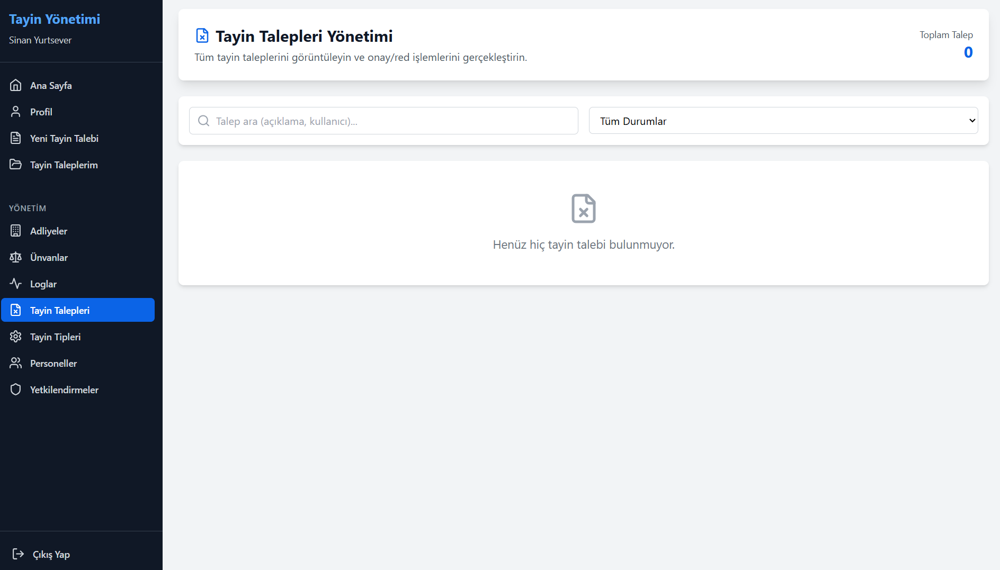
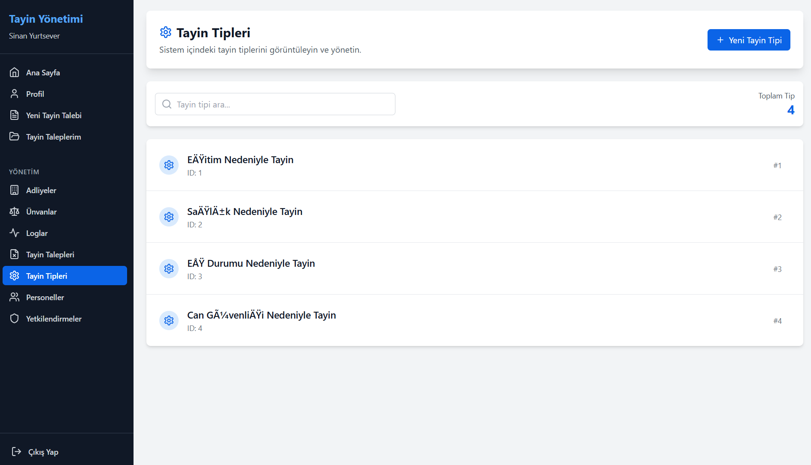
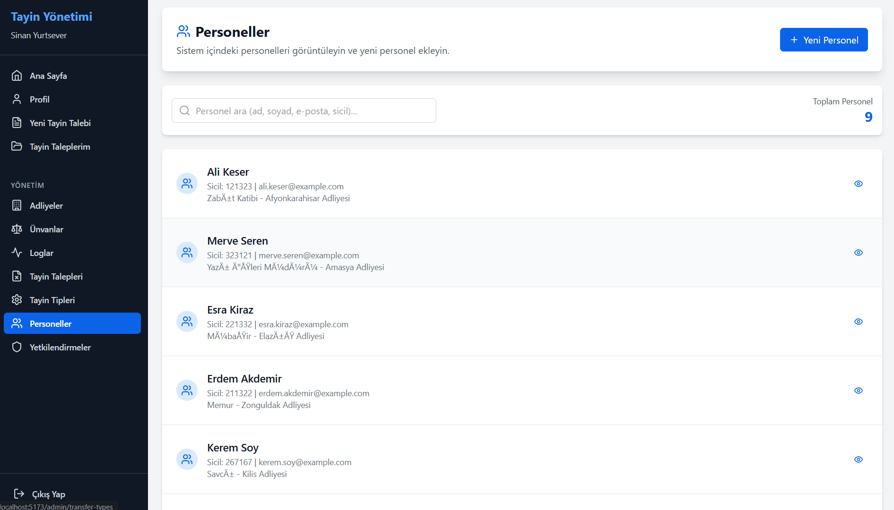
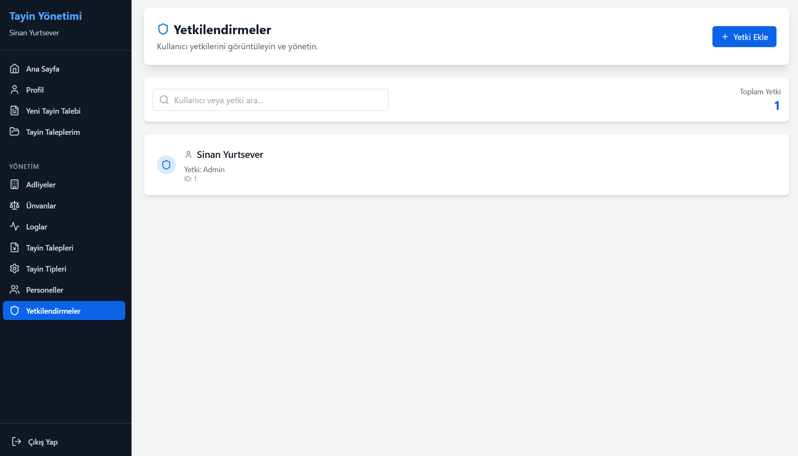

---

🧾 Lisans

Bu proje MIT Lisansı ile lisanslanmıştır.
© 2025 Devrim Deniz

---

👤 Geliştirici

Devrim Deniz
🔗 github.com/SyberTedy# 🏛 Tayin Talep Yönetim Sistemi